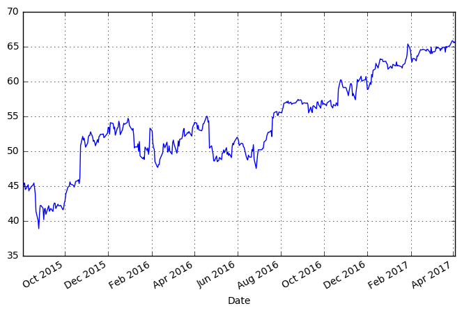

```python
import pandas as pd
import numpy as np
import datetime
import matplotlib
# matplotlib.use('Agg') # Must be before importing matplotlib.pyplot or pylab!
import matplotlib.pyplot as plt
from datetime import date
import pandas_datareader.data as web
# %matplotlib inline
```


```python
start = date(2015, 8, 1)
end = date.today()
```


```python
stock = web.DataReader("MSFT", 'yahoo', start, end)
# stock.info()
stock.head()
```


<div>
<table border="1" class="dataframe">
  <thead>
    <tr style="text-align: right;">
      <th></th>
      <th>Open</th>
      <th>High</th>
      <th>Low</th>
      <th>Close</th>
      <th>Volume</th>
      <th>Adj Close</th>
    </tr>
    <tr>
      <th>Date</th>
      <th></th>
      <th></th>
      <th></th>
      <th></th>
      <th></th>
      <th></th>
    </tr>
  </thead>
  <tbody>
    <tr>
      <th>2015-08-03</th>
      <td>46.980000</td>
      <td>47.000000</td>
      <td>46.450001</td>
      <td>46.810001</td>
      <td>24125900</td>
      <td>44.687410</td>
    </tr>
    <tr>
      <th>2015-08-04</th>
      <td>46.750000</td>
      <td>47.709999</td>
      <td>46.680000</td>
      <td>47.540001</td>
      <td>33403900</td>
      <td>45.384308</td>
    </tr>
    <tr>
      <th>2015-08-05</th>
      <td>47.980000</td>
      <td>48.410000</td>
      <td>47.540001</td>
      <td>47.580002</td>
      <td>26959700</td>
      <td>45.422495</td>
    </tr>
    <tr>
      <th>2015-08-06</th>
      <td>47.709999</td>
      <td>47.770000</td>
      <td>46.330002</td>
      <td>46.619999</td>
      <td>27368000</td>
      <td>44.506023</td>
    </tr>
    <tr>
      <th>2015-08-07</th>
      <td>46.389999</td>
      <td>46.779999</td>
      <td>46.259998</td>
      <td>46.740002</td>
      <td>19163000</td>
      <td>44.620584</td>
    </tr>
  </tbody>
</table>
</div>


```python
max = stock["High"].max()
min = stock["Low"].min()
print(max)
print(min)
```

    66.190002
    39.720001


```python
stock["Adj Close"].plot(grid=True, figsize=(8,5))
plt.show()
```





```python
stock["Return"] = 0.0
stock['Return'] = np.log(stock['Adj Close']/stock['Adj Close'].shift(1))
stock[["Adj Close", "Return"]].tail()
```


<div>
<table border="1" class="dataframe">
  <thead>
    <tr style="text-align: right;">
      <th></th>
      <th>Adj Close</th>
      <th>Return</th>
    </tr>
    <tr>
      <th>Date</th>
      <th></th>
      <th></th>
    </tr>
  </thead>
  <tbody>
    <tr>
      <th>2017-03-29</th>
      <td>65.470001</td>
      <td>0.002753</td>
    </tr>
    <tr>
      <th>2017-03-30</th>
      <td>65.709999</td>
      <td>0.003659</td>
    </tr>
    <tr>
      <th>2017-03-31</th>
      <td>65.860001</td>
      <td>0.002280</td>
    </tr>
    <tr>
      <th>2017-04-03</th>
      <td>65.550003</td>
      <td>-0.004718</td>
    </tr>
    <tr>
      <th>2017-04-04</th>
      <td>65.730003</td>
      <td>0.002742</td>
    </tr>
  </tbody>
</table>
</div>


```python

```
