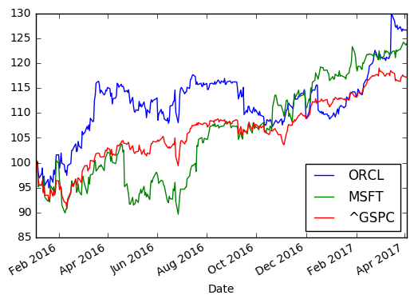
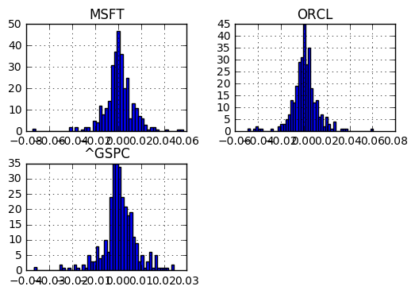

```python
import pandas as pd
import numpy as np
import datetime
from datetime import date
import matplotlib.pyplot as plt
import pandas_datareader.data as web
```


```python
symbols = ["ORCL","MSFT", "^GSPC"]
```


```python
data = pd.DataFrame()
```


```python
start = date(2016, 1, 1)
end = date.today()
```


```python
for ticker in symbols:
    data[ticker] = web.DataReader(ticker, 'yahoo', start, end)["Adj Close"]
```


```python
data.tail()
```


<div>
<table border="1" class="dataframe">
  <thead>
    <tr style="text-align: right;">
      <th></th>
      <th>ORCL</th>
      <th>MSFT</th>
      <th>^GSPC</th>
    </tr>
    <tr>
      <th>Date</th>
      <th></th>
      <th></th>
      <th></th>
    </tr>
  </thead>
  <tbody>
    <tr>
      <th>2017-03-29</th>
      <td>44.520000</td>
      <td>65.470001</td>
      <td>2361.129883</td>
    </tr>
    <tr>
      <th>2017-03-30</th>
      <td>44.680000</td>
      <td>65.709999</td>
      <td>2368.060059</td>
    </tr>
    <tr>
      <th>2017-03-31</th>
      <td>44.610001</td>
      <td>65.860001</td>
      <td>2362.719971</td>
    </tr>
    <tr>
      <th>2017-04-03</th>
      <td>44.610001</td>
      <td>65.550003</td>
      <td>2358.840088</td>
    </tr>
    <tr>
      <th>2017-04-04</th>
      <td>44.590000</td>
      <td>65.730003</td>
      <td>2360.159912</td>
    </tr>
  </tbody>
</table>
</div>


```python
#We use 100 as a starting value
#Using ix as a primarily label-location based indexer
(data/data.ix[0] * 100).plot()
plt.show()
```





```python
#Calculating log returns
log_returns = np.log(data/data.shift(1))
log_returns.tail()
```


<div>
<table border="1" class="dataframe">
  <thead>
    <tr style="text-align: right;">
      <th></th>
      <th>ORCL</th>
      <th>MSFT</th>
      <th>^GSPC</th>
    </tr>
    <tr>
      <th>Date</th>
      <th></th>
      <th></th>
      <th></th>
    </tr>
  </thead>
  <tbody>
    <tr>
      <th>2017-03-29</th>
      <td>-0.003811</td>
      <td>0.002753</td>
      <td>0.001085</td>
    </tr>
    <tr>
      <th>2017-03-30</th>
      <td>0.003587</td>
      <td>0.003659</td>
      <td>0.002931</td>
    </tr>
    <tr>
      <th>2017-03-31</th>
      <td>-0.001568</td>
      <td>0.002280</td>
      <td>-0.002258</td>
    </tr>
    <tr>
      <th>2017-04-03</th>
      <td>0.000000</td>
      <td>-0.004718</td>
      <td>-0.001643</td>
    </tr>
    <tr>
      <th>2017-04-04</th>
      <td>-0.000448</td>
      <td>0.002742</td>
      <td>0.000559</td>
    </tr>
  </tbody>
</table>
</div>


```python
log_returns.hist(bins=50)
plt.show()
```





```python

```
