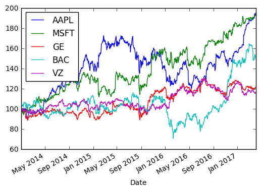
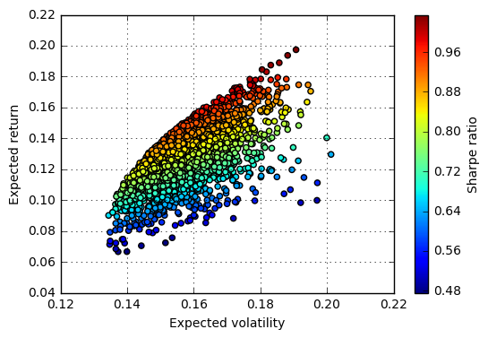

```python
import pandas as pd
import numpy as np
import datetime
from datetime import date
import matplotlib.pyplot as plt
import pandas_datareader.data as web
```


```python
start = date(2014, 1, 1)
end = date.today()
```


```python
portfolio = ["AAPL","MSFT","GE","BAC", "VZ"]
data = pd.DataFrame()
for co in portfolio:
    data[co] = web.DataReader(co, 'yahoo', start, end)["Adj Close"]
```


```python
(data/data.ix[0] * 100).plot()
plt.show()
```





```python
#Calculating returns
returns = np.log(data/data.shift(1))
returns.tail()
```


<div>
<table border="1" class="dataframe">
  <thead>
    <tr style="text-align: right;">
      <th></th>
      <th>AAPL</th>
      <th>MSFT</th>
      <th>GE</th>
      <th>BAC</th>
      <th>VZ</th>
    </tr>
    <tr>
      <th>Date</th>
      <th></th>
      <th></th>
      <th></th>
      <th></th>
      <th></th>
    </tr>
  </thead>
  <tbody>
    <tr>
      <th>2017-03-30</th>
      <td>-0.001319</td>
      <td>0.003659</td>
      <td>0.006381</td>
      <td>0.022025</td>
      <td>-0.001426</td>
    </tr>
    <tr>
      <th>2017-03-31</th>
      <td>-0.001878</td>
      <td>0.002280</td>
      <td>-0.002346</td>
      <td>-0.011800</td>
      <td>-0.006339</td>
    </tr>
    <tr>
      <th>2017-04-03</th>
      <td>0.000278</td>
      <td>-0.004718</td>
      <td>0.002681</td>
      <td>0.000000</td>
      <td>0.008782</td>
    </tr>
    <tr>
      <th>2017-04-04</th>
      <td>0.007419</td>
      <td>0.002742</td>
      <td>0.004674</td>
      <td>-0.006379</td>
      <td>0.002640</td>
    </tr>
    <tr>
      <th>2017-04-05</th>
      <td>-0.005194</td>
      <td>-0.002590</td>
      <td>-0.001667</td>
      <td>-0.011586</td>
      <td>-0.005899</td>
    </tr>
  </tbody>
</table>
</div>


```python
#Mean-variance of returns
#Since we have significant differences in performance, 
#we have to use 252 trading days to annualize the daily returns 
returns.mean() * 252
```


    AAPL    0.204157
    MSFT    0.201207
    GE      0.059443
    BAC     0.123540
    VZ      0.045016
    dtype: float64


```python
#Building covariance matrix
returns.cov() * 252
```


<div>
<table border="1" class="dataframe">
  <thead>
    <tr style="text-align: right;">
      <th></th>
      <th>AAPL</th>
      <th>MSFT</th>
      <th>GE</th>
      <th>BAC</th>
      <th>VZ</th>
    </tr>
  </thead>
  <tbody>
    <tr>
      <th>AAPL</th>
      <td>0.054934</td>
      <td>0.023119</td>
      <td>0.015292</td>
      <td>0.020284</td>
      <td>0.009775</td>
    </tr>
    <tr>
      <th>MSFT</th>
      <td>0.023119</td>
      <td>0.051845</td>
      <td>0.018401</td>
      <td>0.024185</td>
      <td>0.014020</td>
    </tr>
    <tr>
      <th>GE</th>
      <td>0.015292</td>
      <td>0.018401</td>
      <td>0.031882</td>
      <td>0.023872</td>
      <td>0.010956</td>
    </tr>
    <tr>
      <th>BAC</th>
      <td>0.020284</td>
      <td>0.024185</td>
      <td>0.023872</td>
      <td>0.070885</td>
      <td>0.009580</td>
    </tr>
    <tr>
      <th>VZ</th>
      <td>0.009775</td>
      <td>0.014020</td>
      <td>0.010956</td>
      <td>0.009580</td>
      <td>0.023921</td>
    </tr>
  </tbody>
</table>
</div>


```python
#We assume that we do not open short position and we divide our money equally divided among 5 stocks
#So we generate 5 random numbers and then normalize them so that values would sum up 100% net oper assets
noa = len(portfolio)
weights = np.random.random(noa)
weights /= np.sum(weights)
weights
```


    array([ 0.11260421,  0.29492142,  0.03586305,  0.32257526,  0.23403606])


```python
#Calculating Expected portfolio return based on the weights
expected_return = np.sum(returns.mean() * weights) * 252
expected_return
```


    0.13484744373303367


```python
#Now lets calculate Expected portfolio variance using our covariance matrix
#we use np.dot -  gets us a product of two matrices
expected_variance = np.dot(weights.T, np.dot(returns.cov() * 252, weights))
expected_variance
```


    0.026689968091524602


```python
#Now we calculate expected standard deviation or volatility 
volatility = np.sqrt(np.dot(weights.T, np.dot(returns.cov() * 252, weights))) 
volatility
```


    0.16337064635828738


```python
#Monte Carlo simulation to generate random portfolio weight vectors on larger scale
#For every simulated allocation we record the resulting portfolio return and variance
#We assume Risk free is 0
mrets = []
mvols = []
for i in range(2500):
    weights = np.random.random(noa)
    weights /= np.sum(weights)
    mrets.append(np.sum(returns.mean() * weights) * 252)
    mvols.append(np.sqrt(np.dot(weights.T, np.dot(returns.cov() * 252, weights ))))
    
mrets = np.array(mrets)
mvols = np.array(mvols)
```


```python
#Lets plot it
plt.figure()
plt.scatter(mvols, mrets, c=mrets / mvols, marker='o')
plt.grid(True)
plt.xlabel('Expected volatility')
plt.ylabel('Expected return')
plt.colorbar(label="Sharpe ratio")
plt.show()
```





```python

```
