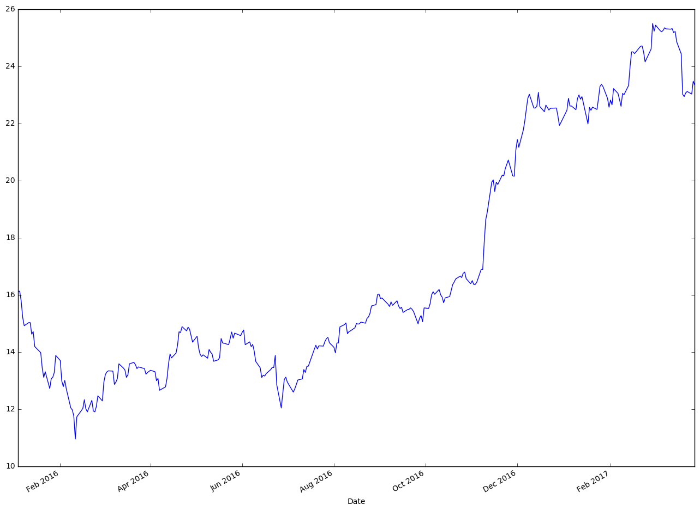
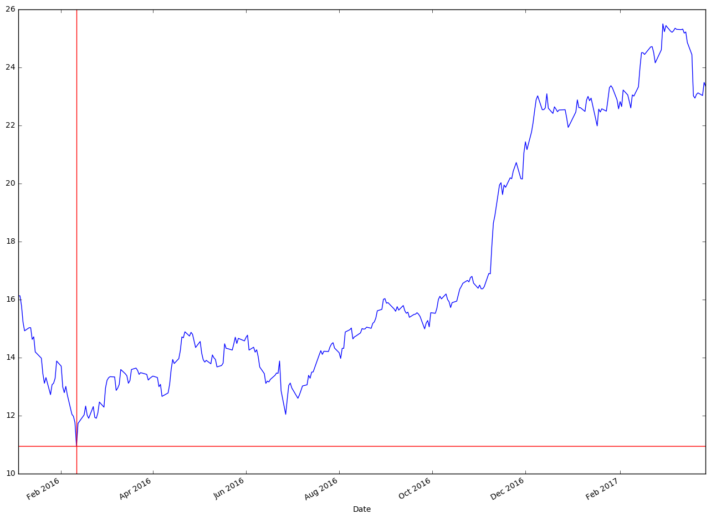

```python
#import pandas
import pandas as pd
from datetime import date
```


```python
# create a new variable to hold data and set dates as index
new_file = pd.read_csv("Downloads/table.csv",parse_dates=['Date'])
new_file.set_index('Date',inplace=True)  
print(new_file.head(2))
    
```

                 Open   High        Low  Close    Volume  Adj Close
    Date                                                           
    2017-03-29  23.51  23.65  23.309999  23.35  66798100      23.35
    2017-03-28  23.01  23.67  23.000000  23.48  95089300      23.48


```python
#import matplotlib
import matplotlib.pyplot as plt
```


```python
# use plot and plt.show() to plot graph
new_file['Adj Close'].plot(figsize=(16, 12))
plt.show()
```





```python
# lets get the minimum Adj closing price and get index
min_close_price = new_file['Adj Close'].min()
idx_close_price = new_file['Adj Close'].idxmin()
print(min_close_price)
idx_close_price
```

    10.954623


    Timestamp('2016-02-11 00:00:00')


```python
# now we want to draw lines at that index and min price
new_file['Adj Close'].plot(figsize=(16, 12))
verical_line = plt.axvline(date(2016,2,11), linewidth=1, color='r')
horizontal_line = plt.axhline(y=min_close_price, linewidth=1, color='r')
```


```python
# if you want to save this chart do it before you call show()

plt.savefig('stock_chart.pdf', format='pdf')
plt.show()
```





```python

```
