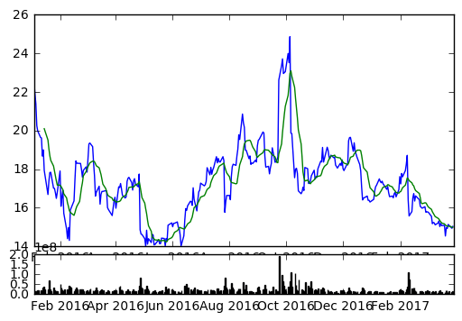

```python
# Importing liabraries and DataReader
import pandas as pd 
import pandas_datareader.data as web
import matplotlib.pyplot as plt 
import datetime
from datetime import date
```


```python
# Setting time range
start = date(2016,1,1)
end = date.today()
```


```python
# Getting data for a stock
stock_price = web.DataReader("TWTR", "yahoo", start, end)
stock_price.tail(5)
```


<div>
<table border="1" class="dataframe">
  <thead>
    <tr style="text-align: right;">
      <th></th>
      <th>Open</th>
      <th>High</th>
      <th>Low</th>
      <th>Close</th>
      <th>Volume</th>
      <th>Adj Close</th>
    </tr>
    <tr>
      <th>Date</th>
      <th></th>
      <th></th>
      <th></th>
      <th></th>
      <th></th>
      <th></th>
    </tr>
  </thead>
  <tbody>
    <tr>
      <th>2017-03-23</th>
      <td>14.99</td>
      <td>15.05</td>
      <td>14.73</td>
      <td>14.93</td>
      <td>11254100</td>
      <td>14.93</td>
    </tr>
    <tr>
      <th>2017-03-24</th>
      <td>15.06</td>
      <td>15.37</td>
      <td>15.03</td>
      <td>15.14</td>
      <td>15514800</td>
      <td>15.14</td>
    </tr>
    <tr>
      <th>2017-03-27</th>
      <td>15.02</td>
      <td>15.06</td>
      <td>14.75</td>
      <td>14.99</td>
      <td>10434000</td>
      <td>14.99</td>
    </tr>
    <tr>
      <th>2017-03-28</th>
      <td>15.00</td>
      <td>15.17</td>
      <td>14.80</td>
      <td>14.94</td>
      <td>14795400</td>
      <td>14.94</td>
    </tr>
    <tr>
      <th>2017-03-29</th>
      <td>14.86</td>
      <td>15.06</td>
      <td>14.70</td>
      <td>15.04</td>
      <td>11022200</td>
      <td>15.04</td>
    </tr>
  </tbody>
</table>
</div>


```python
stock_price["MA"] = stock_price["Adj Close"].rolling(window=10).mean()
# stock_price.head()
stock_price.tail()
```


<div>
<table border="1" class="dataframe">
  <thead>
    <tr style="text-align: right;">
      <th></th>
      <th>Open</th>
      <th>High</th>
      <th>Low</th>
      <th>Close</th>
      <th>Volume</th>
      <th>Adj Close</th>
      <th>MA</th>
    </tr>
    <tr>
      <th>Date</th>
      <th></th>
      <th></th>
      <th></th>
      <th></th>
      <th></th>
      <th></th>
      <th></th>
    </tr>
  </thead>
  <tbody>
    <tr>
      <th>2017-03-23</th>
      <td>14.99</td>
      <td>15.05</td>
      <td>14.73</td>
      <td>14.93</td>
      <td>11254100</td>
      <td>14.93</td>
      <td>15.049</td>
    </tr>
    <tr>
      <th>2017-03-24</th>
      <td>15.06</td>
      <td>15.37</td>
      <td>15.03</td>
      <td>15.14</td>
      <td>15514800</td>
      <td>15.14</td>
      <td>15.051</td>
    </tr>
    <tr>
      <th>2017-03-27</th>
      <td>15.02</td>
      <td>15.06</td>
      <td>14.75</td>
      <td>14.99</td>
      <td>10434000</td>
      <td>14.99</td>
      <td>15.029</td>
    </tr>
    <tr>
      <th>2017-03-28</th>
      <td>15.00</td>
      <td>15.17</td>
      <td>14.80</td>
      <td>14.94</td>
      <td>14795400</td>
      <td>14.94</td>
      <td>14.991</td>
    </tr>
    <tr>
      <th>2017-03-29</th>
      <td>14.86</td>
      <td>15.06</td>
      <td>14.70</td>
      <td>15.04</td>
      <td>11022200</td>
      <td>15.04</td>
      <td>14.992</td>
    </tr>
  </tbody>
</table>
</div>


```python
# stock_price.plot()
stock_price[["Adj Close", "MA"]].plot()
plt.show()
```


```python
# we create grids
price_fig = plt.subplot2grid((6,1),(0,0), rowspan=5, colspan=1)
volume_fig = plt.subplot2grid((6,1),(5,0), rowspan=1, colspan=1, sharex=price_fig)
```


```python
price_fig.plot(stock_price.index, stock_price['Adj Close'])
price_fig.plot(stock_price.index, stock_price['MA'])
volume_fig.bar(stock_price.index, stock_price['Volume'])

plt.show()
```





```python

```
