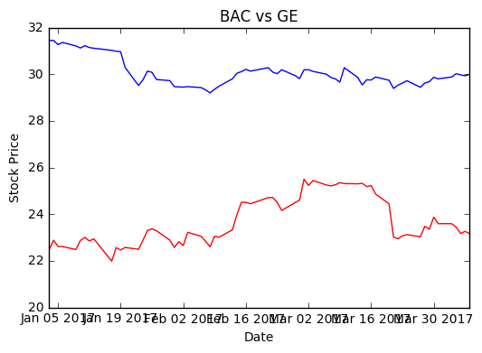

```python
import matplotlib.pyplot as plt
import pandas as pd 
from pandas import DataFrame as df
import pandas_datareader.data as web
from datetime import date
```


```python
start = date(2017, 1, 1)
end = date.today()

```


```python
bac = web.DataReader("BAC", 'yahoo', start, end)
ge = web.DataReader("GE", 'yahoo', start, end)
```


```python
# bac.index
```


```python
# graphs on common axes
plt.plot(bac.index, bac["Adj Close"], 'red')
# appears on same axes
plt.plot(bac.index, ge["Adj Close"], 'blue')
plt.xlabel('Date')
plt.ylabel('Stock Price')
plt.title("BAC vs GE")
plt.show()
```





```python

```
