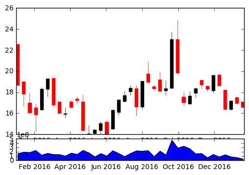

```python
import pandas as pd 
import pandas_datareader.data as web
import matplotlib.pyplot as plt 
from matplotlib.finance import candlestick_ohlc
import matplotlib.dates as mdates
```


```python
import datetime
from datetime import date
```


```python
start = date(2016,1,1)
end = date(2017,1,20)
```


```python
stock_price = web.DataReader("TWTR", "yahoo", start, end)
```


```python
ten_days = stock_price['Adj Close'].resample('10D').ohlc()
stock_volume = stock_price['Volume'].resample('10D').sum()
# stock_volume.tail()
ten_days.tail()
```


<div>
<table border="1" class="dataframe">
  <thead>
    <tr style="text-align: right;">
      <th></th>
      <th>open</th>
      <th>high</th>
      <th>low</th>
      <th>close</th>
    </tr>
    <tr>
      <th>Date</th>
      <th></th>
      <th></th>
      <th></th>
      <th></th>
    </tr>
  </thead>
  <tbody>
    <tr>
      <th>2016-12-09</th>
      <td>19.650000</td>
      <td>19.650000</td>
      <td>18.629999</td>
      <td>18.629999</td>
    </tr>
    <tr>
      <th>2016-12-19</th>
      <td>18.240000</td>
      <td>18.240000</td>
      <td>16.389999</td>
      <td>16.389999</td>
    </tr>
    <tr>
      <th>2016-12-29</th>
      <td>16.389999</td>
      <td>17.170000</td>
      <td>16.299999</td>
      <td>17.170000</td>
    </tr>
    <tr>
      <th>2017-01-08</th>
      <td>17.500000</td>
      <td>17.500000</td>
      <td>16.959999</td>
      <td>16.959999</td>
    </tr>
    <tr>
      <th>2017-01-18</th>
      <td>17.110001</td>
      <td>17.110001</td>
      <td>16.580000</td>
      <td>16.580000</td>
    </tr>
  </tbody>
</table>
</div>


```python
ten_days.reset_index(inplace=True)
```


```python
ten_days.tail()
```


<div>
<table border="1" class="dataframe">
  <thead>
    <tr style="text-align: right;">
      <th></th>
      <th>Date</th>
      <th>open</th>
      <th>high</th>
      <th>low</th>
      <th>close</th>
    </tr>
  </thead>
  <tbody>
    <tr>
      <th>34</th>
      <td>2016-12-09</td>
      <td>19.650000</td>
      <td>19.650000</td>
      <td>18.629999</td>
      <td>18.629999</td>
    </tr>
    <tr>
      <th>35</th>
      <td>2016-12-19</td>
      <td>18.240000</td>
      <td>18.240000</td>
      <td>16.389999</td>
      <td>16.389999</td>
    </tr>
    <tr>
      <th>36</th>
      <td>2016-12-29</td>
      <td>16.389999</td>
      <td>17.170000</td>
      <td>16.299999</td>
      <td>17.170000</td>
    </tr>
    <tr>
      <th>37</th>
      <td>2017-01-08</td>
      <td>17.500000</td>
      <td>17.500000</td>
      <td>16.959999</td>
      <td>16.959999</td>
    </tr>
    <tr>
      <th>38</th>
      <td>2017-01-18</td>
      <td>17.110001</td>
      <td>17.110001</td>
      <td>16.580000</td>
      <td>16.580000</td>
    </tr>
  </tbody>
</table>
</div>


```python
ten_days["Date"] = ten_days["Date"].map(mdates.date2num)
```


```python
ten_days["Date"].tail()
```


    34    736307.0
    35    736317.0
    36    736327.0
    37    736337.0
    38    736347.0
    Name: Date, dtype: float64


```python
# creating two figures
price_fig = plt.subplot2grid((6,1),(0,0), rowspan=5, colspan=1)
volume_fig = plt.subplot2grid((6,1),(5,0), rowspan=1, colspan=1, sharex=price_fig)
```


```python
# plotting data
price_fig.xaxis_date()
candlestick_ohlc(price_fig, ten_days.values, width=5)
volume_fig.fill_between(stock_volume.index.map(mdates.date2num), stock_volume.values, 0)

plt.show()
```





```python

```
